# LAB 2 — Rooting Android sur AVD

> **Cours** : Sécurité des applications mobiles
> **Environnement** : Android Virtual Device (AVD) — Android Studio
> **Données utilisées** : Fictives uniquement

---

## Objectifs

Ce laboratoire a pour but d'étudier le rooting Android dans un environnement contrôlé et isolé.
Les manipulations ont été réalisées exclusivement sur un émulateur (AVD), sans aucun appareil physique personnel impliqué.

Les points étudiés sont les suivants :

- Obtenir un accès root via ADB et en mesurer la portée réelle
- Observer les mécanismes d'intégrité Android : Verified Boot, AVB et dm-verity
- Comprendre la distinction entre root ADB et modification effective de la partition système
- Installer et tester une application dans un environnement rooté
- Collecter et organiser les preuves techniques du lab

---

## Environnement technique

| Paramètre | Valeur |
|---|---|
| Outil | Android Studio + Android Virtual Device |
| Modèle AVD | Pixel 2 XL |
| Image système | Android API 36 — Google APIs x86_64 |
| Application testée | `app-debug.apk` — package `com.example.projetws` |
| Type de données | Fictives uniquement |

---

## Structure du projet

```text
Lab_Root_AVD/
├── README.md
├── app-debug.apk              ← APK de test (build debug)
├── images/
│   ├── 01_creation_dossier_lab.png
│   ├── 02_adb_devices.png
│   ├── 03_boot_completed.png
│   ├── 04_adb_root_success.png
│   ├── 05_remount_bootloader_locked.png
│   ├── 06_logs_id_verity_vbmeta.png
│   ├── 07_verified_verity_vbmeta_props.png
│   ├── 08_saved_verified_verity_vbmeta_logs.png
│   ├── 09_verified_verity_vbmeta_final.png
│   ├── 10_liste_fichiers_logs.png
│   ├── 11_apk_presente_dossier_lab.png
│   ├── 12_installation_apk_success.png
│   ├── 13_liste_packages_android.png
│   ├── 14_package_projetws_verifie.png
│   ├── 15_lancement_application_monkey.png
│   ├── 16_id_check_root_apres_installation.png
│   ├── 17_scenario_1_home.png
│   ├── 18_scenario_2_formulaire_rempli.png
│   ├── 19_scenario_3_validation.png
│   ├── 20_logcat_app_scenarios.txt
│   ├── 21_remount_blocked.png
│   ├── 22_wipe_data.png
│   └── 23_avd_clean_after_reset.png
└── logs/
    ├── adb_devices.txt          ← Détection de l'AVD
    ├── adb_root.txt             ← Résultat de adb root
    ├── adb_remount.txt          ← Première tentative de remount
    ├── adb_remount_clean.txt    ← Tentative de remount finale
    ├── id_check.txt             ← Résultat de adb shell id
    ├── logcat_app_scenarios.txt ← Logs applicatifs pendant les scénarios
    ├── logcat_root_check.txt    ← Logs système liés au contexte root
    ├── root_checks.txt          ← Synthèse des vérifications root
    ├── vbmeta_props.txt         ← Propriétés ro.boot.vbmeta.*
    ├── verified_props.txt       ← Propriétés partition.*.verified.*
    ├── verity_props.txt         ← Propriétés dm-verity
    └── veritymode.txt           ← Valeur de ro.boot.veritymode
```

> **Note sur l'APK** : Le fichier `app-debug.apk` est inclus à titre de preuve pour ce laboratoire.
> Il s'agit d'une build debug générée depuis Android Studio (`Build > Build APK`).
> Pour un dépôt public, il est recommandé de l'exclure via `.gitignore` et de le regénérer localement depuis le projet source.

---

## Déroulement

### Étape 1 — Préparation de l'espace de travail

Le dossier `Lab_Root_AVD` a été créé avec deux sous-dossiers dédiés : `images/` pour les captures d'écran et `logs/` pour les sorties de commandes ADB.

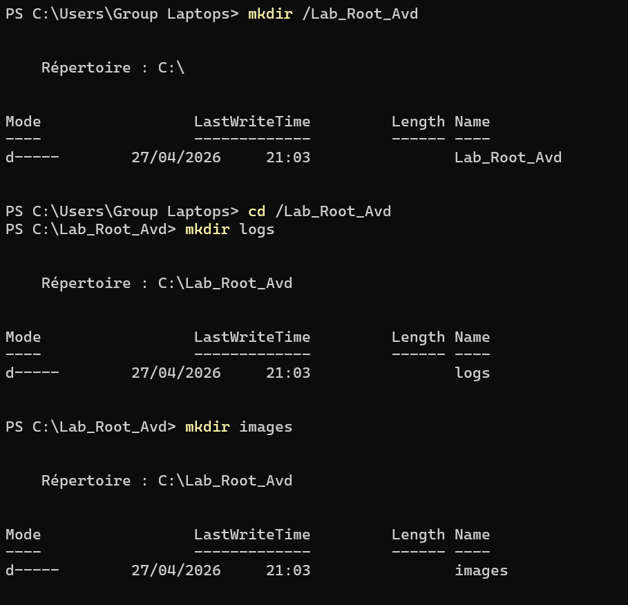

---

### Étape 2 — Détection de l'AVD

```powershell
adb devices
```

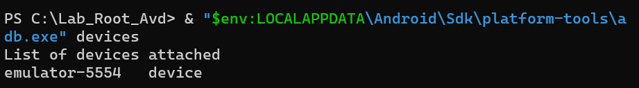

Extrait de `logs/adb_devices.txt` :

```
List of devices attached
emulator-5554   offline
emulator-5556   device
```

L'entrée `emulator-5556 device` confirme que l'émulateur est actif et utilisable. L'entrée `offline` correspond à une ancienne instance inactive.

---

### Étape 3 — Vérification du démarrage

```powershell
adb shell getprop sys.boot_completed
```

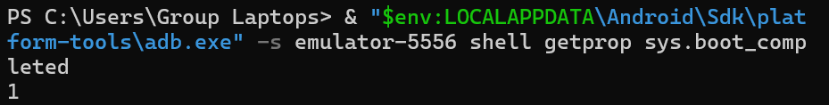

La valeur `1` confirme que le système a terminé son initialisation avant tout test.

---

### Étape 4 — Activation du root ADB

```powershell
adb root
adb shell id
```

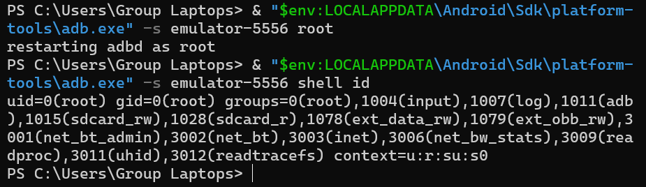

Résultat obtenu (`logs/id_check.txt`) :

```
uid=0(root) gid=0(root)
```

Le démon ADB a redémarré en mode root. Le shell dispose désormais des privilèges administrateur sur l'émulateur.

---

### Étape 5 — Tentative de remontage de la partition système

```powershell
adb remount
```

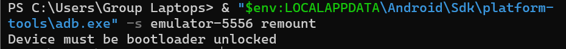

Résultat (`logs/adb_remount.txt`) :

```
Device must be bootloader unlocked
```

> **Point central du lab** : le root ADB est actif, mais la partition système reste montée en lecture seule. Le bootloader verrouillé maintient les protections système intactes.
>
> **Conclusion : root ADB ≠ partition système librement modifiable.**

Ce résultat est intentionnel. Sur un AVD standard, le root ADB est une fonctionnalité prévue pour le débogage, mais elle n'implique pas un accès complet au système de fichiers.

---

### Étape 6 — Vérification des mécanismes d'intégrité

Les propriétés système ont été interrogées pour évaluer l'état de Verified Boot, dm-verity et VBMeta.

```powershell
adb shell getprop | findstr "verified"
adb shell getprop | findstr "verity"
adb shell getprop | findstr "vbmeta"
```

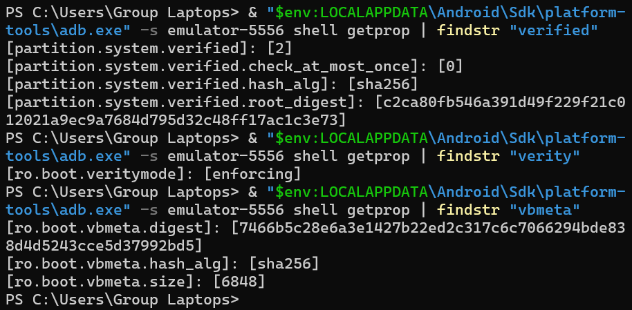

Résultats clés (voir `logs/vbmeta_props.txt`, `verified_props.txt`, `verity_props.txt`, `veritymode.txt`) :

```
ro.boot.veritymode = enforcing
ro.boot.vbmeta.hash_alg = sha256
partition.system.verified.hash_alg = sha256
```

Ces valeurs montrent que :

- **dm-verity** est actif en mode `enforcing` : toute modification non autorisée des partitions système serait détectée et bloquée au démarrage
- **VBMeta** est présent et utilise SHA-256 pour la vérification cryptographique
- La **partition system** est vérifiée à chaque démarrage

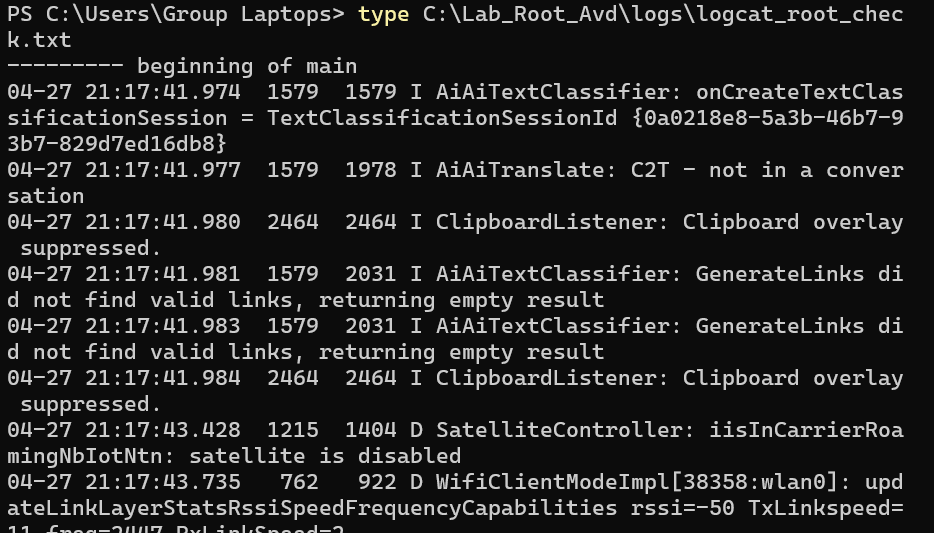

---

### Étape 7 — Installation de l'application de test

L'APK `app-debug.apk` correspond au projet Android `projetws`. Elle est utilisée exclusivement avec des données fictives.

```powershell
adb install -r C:\Lab_Root_AVD\app-debug.apk
```

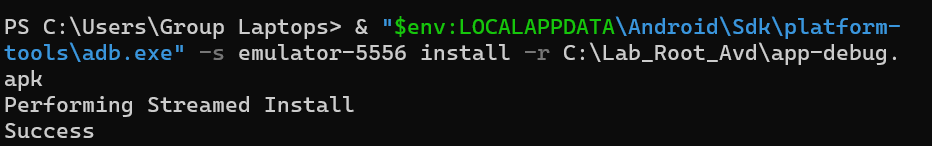

Vérification du package installé :

```powershell
adb shell pm list packages | findstr "projetws"
```

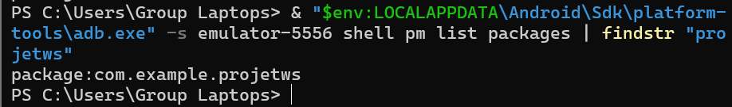

```
package:com.example.projetws
```

Lancement de l'application :

```powershell
adb shell monkey -p com.example.projetws -c android.intent.category.LAUNCHER 1
```

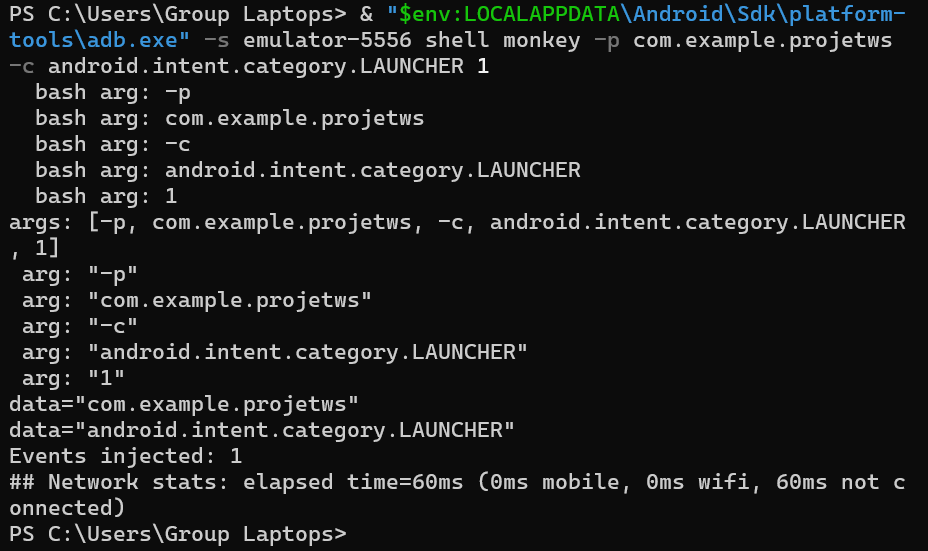

Confirmation du contexte root après installation :

```powershell
adb shell id
```

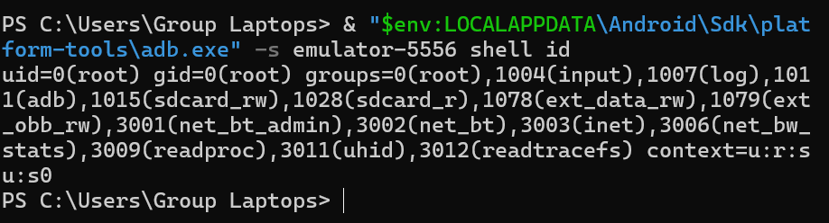

```
uid=0(root) gid=0(root)
```

---

### Étape 8 — Scénarios fonctionnels

Trois scénarios ont été exécutés avec des données entièrement fictives.

**Scénario 1 — Ouverture de l'application**

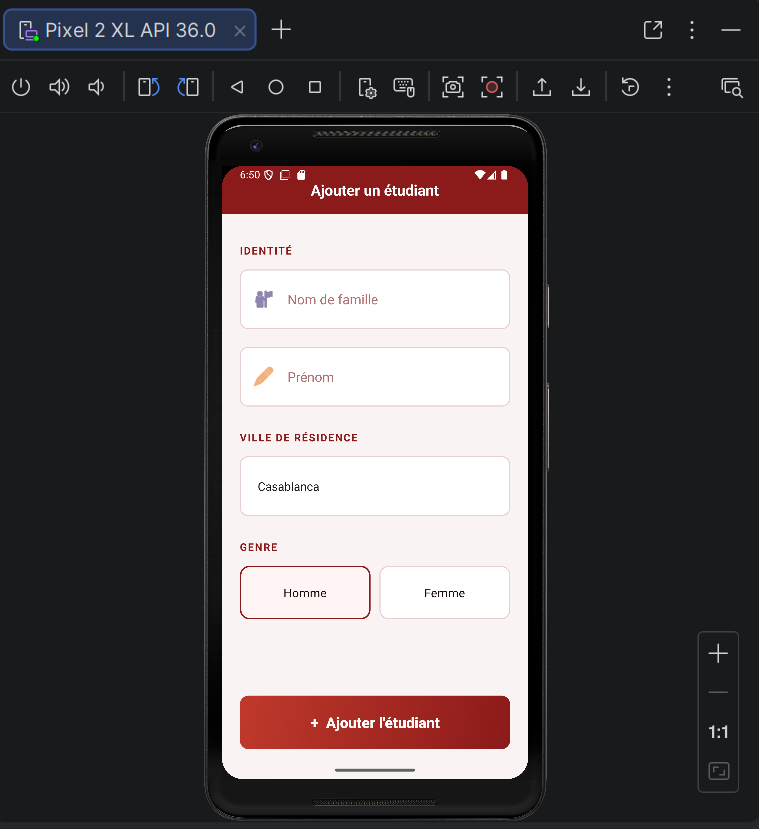

L'écran *Ajouter un étudiant* s'affiche correctement.

---

**Scénario 2 — Saisie d'un enregistrement fictif**

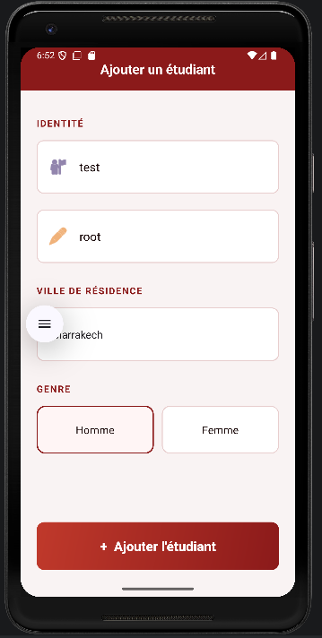

| Champ | Valeur fictive |
|---|---|
| Nom | test |
| Prénom | root |
| Ville | Marrakech |
| Genre | Homme |

---

**Scénario 3 — Validation**

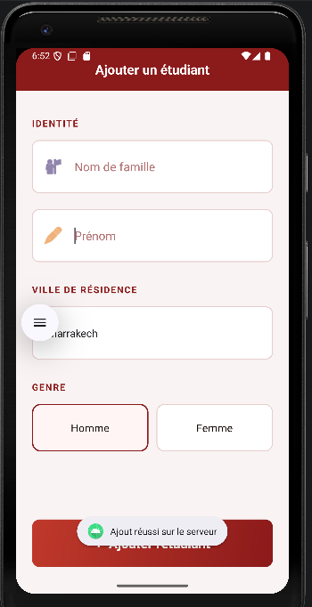

Message retourné : `Ajout réussi sur le serveur`

---

### Étape 9 — Collecte des logs applicatifs

```powershell
adb logcat -d -t 300
```

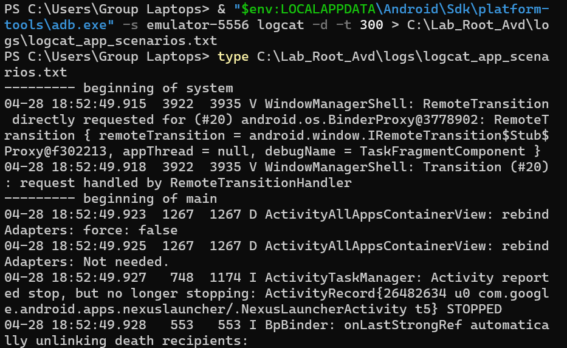

Les logs sont disponibles dans `logs/logcat_app_scenarios.txt` et `logs/logcat_root_check.txt`.

---

### Étape 10 — Réinitialisation de l'AVD

À la fin du lab, l'AVD a été réinitialisé depuis Android Studio via l'option **Wipe Data**.

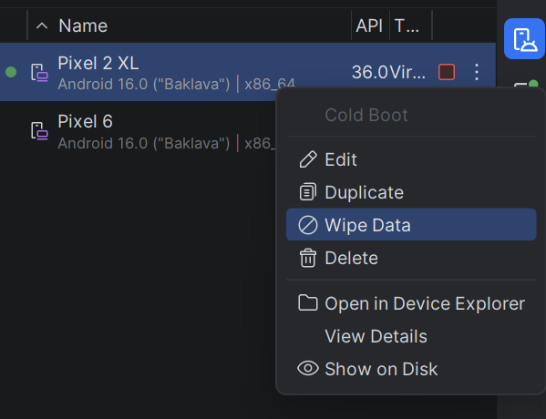


L'émulateur est revenu à son état initial. L'application de test, les données saisies et les traces de session ont été supprimées.

---

## Résultats obtenus

| Commande / Vérification | Résultat |
|---|---|
| `adb root` | `restarting adbd as root` |
| `adb shell id` | `uid=0(root) gid=0(root)` |
| `ro.boot.veritymode` | `enforcing` |
| `ro.boot.vbmeta.hash_alg` | `sha256` |
| `partition.system.verified.hash_alg` | `sha256` |
| `adb remount` | `Device must be bootloader unlocked` |
| Installation APK | `Success` |
| Package détecté | `package:com.example.projetws` |
| Reset final | Wipe Data effectué |

---

## Notions abordées

### Rooting Android

Le rooting consiste à obtenir des privilèges administrateur (`uid=0`) sur un système Android. Cela permet de sortir du sandbox applicatif habituel et d'accéder à des ressources normalement protégées. Dans ce lab, le root est obtenu via `adb root`, une fonctionnalité réservée aux images de développement. Cette méthode ne s'applique pas aux appareils grand public dont le bootloader est verrouillé.

### Verified Boot et Android Verified Boot (AVB)

Verified Boot est un mécanisme qui garantit l'intégrité du système à chaque démarrage, via une chaîne de confiance :

```
Root of Trust → Bootloader → Kernel → Partitions → Android
```

Android Verified Boot (AVB) s'appuie sur **VBMeta**, une structure de données contenant les métadonnées cryptographiques nécessaires à la vérification des partitions. Même en présence d'un accès root ADB, ces mécanismes restent actifs tant que le bootloader est verrouillé.

### dm-verity

dm-verity est un module noyau Linux qui vérifie l'intégrité des partitions en lecture seule (notamment `system`) à l'aide d'un arbre de hachage Merkle. En mode `enforcing`, toute modification non autorisée provoque un échec au démarrage. C'est ce mécanisme qui explique pourquoi `adb remount` est refusé sur l'AVD.

---

## Lien avec OWASP MASVS

| Catégorie | Pertinence dans ce lab |
|---|---|
| MASVS-STORAGE | Un appareil rooté permet d'accéder aux fichiers privés d'une application ; les données locales doivent être chiffrées |
| MASVS-NETWORK | Les logs collectés via `adb logcat` peuvent révéler des communications réseau non sécurisées |
| MASVS-RESILIENCE | L'application ne détecte pas l'environnement rooté, ce qui constitue un point de vigilance |

---

## Checklist finale

| Étape | Statut |
|---|---|
| Dossier de travail créé | ✅ |
| AVD détecté par ADB | ✅ |
| Root ADB activé (`uid=0`) | ✅ |
| dm-verity vérifié (`enforcing`) | ✅ |
| VBMeta vérifié (sha256) | ✅ |
| `adb remount` testé et refusé | ✅ |
| APK installée et package vérifié | ✅ |
| Application lancée via ADB | ✅ |
| 3 scénarios exécutés (données fictives) | ✅ |
| Logs sauvegardés | ✅ |
| AVD réinitialisé (Wipe Data) | ✅ |

---

*Lab réalisé dans un cadre pédagogique, sur environnement virtuel isolé, avec des données entièrement fictives.*
